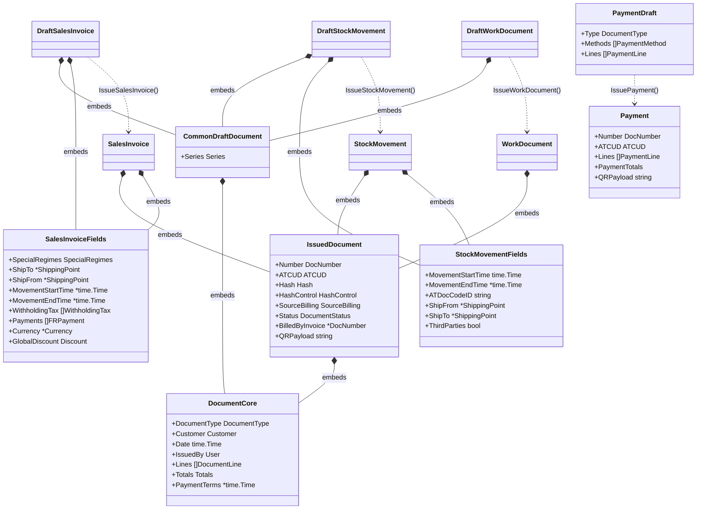
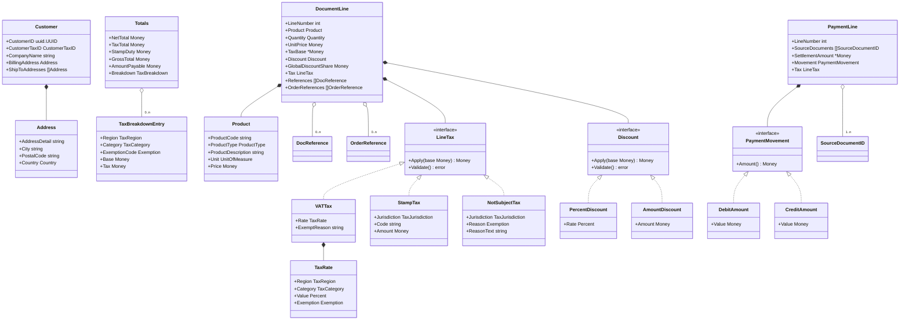
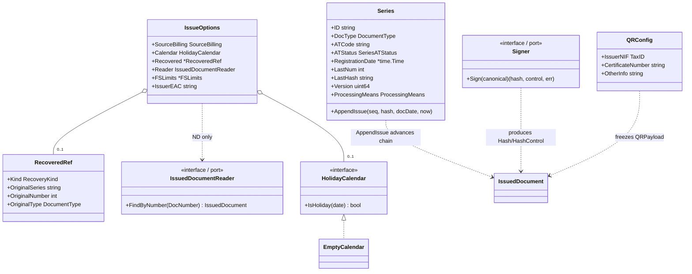
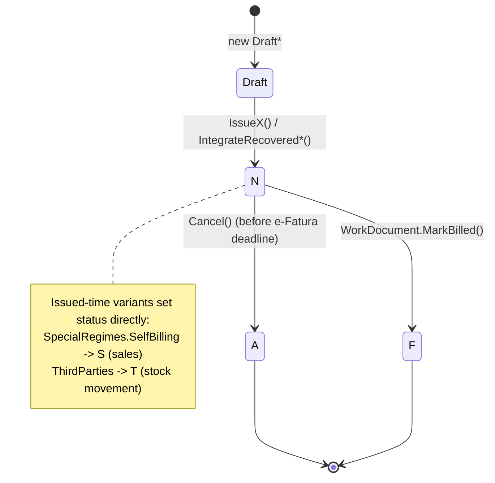
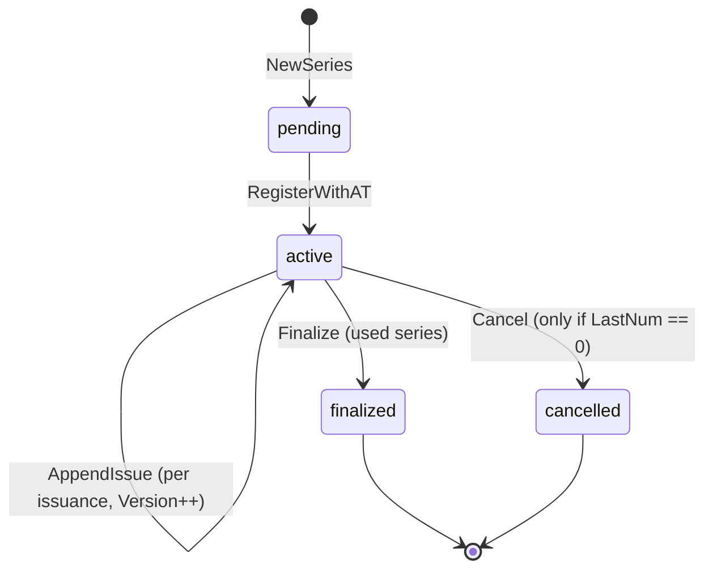
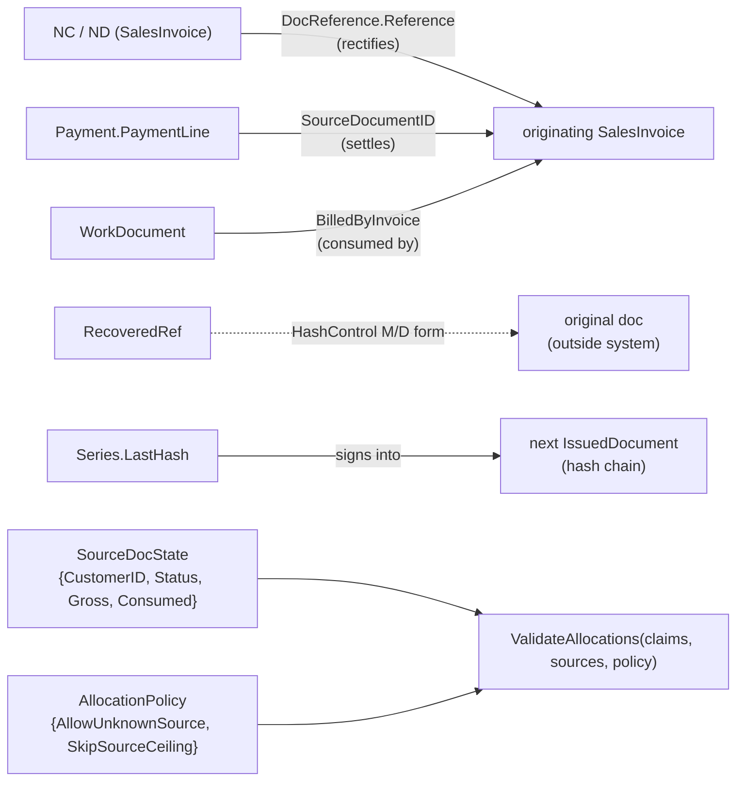

# Domain Model — `internal/domain`

Knowledge map of the pure domain layer: every entity, value object, sealed sum,
and the relationships between them. Adapters (PDF, SAF-T, AT, signing, qrimage)
and the `app` service layer are out of scope — this is the regulatory core only.

**Two parts.** **Part I** (below) is the *structural* map — types, embedding,
taxonomy, lifecycles. **Part II** is the *behavioral contract* — exact arithmetic,
rounding direction, the canonical signing string, the totals & proration
algorithms, the QR field spec, JSON wire formats, and every validation rule. You
need **both** to reimplement this domain in another language: the structure alone
produces a system that *looks* right but signs different bytes (breaking the AT
hash chain) and computes different cents.

> **Why not one class diagram?** Three things this domain leans on are not static
> structure: (1) Go **struct embedding** promotes fields and only *looks* like
> inheritance; (2) the **draft → issued** transformation and the **status / series
> lifecycles** are behavior, expressed as free functions, not associations; (3) the
> **doctype → family → rules** taxonomy is a table. So this doc uses several
> complementary views instead of cramming ~45 types into one picture.

## Reading the diagrams

| Notation | Meaning in Go terms |
|----------|---------------------|
| `A *-- B : embeds` | `A` embeds struct `B` (fields/methods promoted) — **not** inheritance |
| `A *-- B` | `A` owns `B` by value (composition) |
| `A o-- "many" B` | `A` holds a slice/optional of `B` |
| `A --> B` | reference / cross-document association |
| `A <\|.. B` | `B` is a concrete variant of sealed interface `A` (realization) |

---

## View 1 — Document families (the spine)

Every family has a **draft** twin (mutable, pre-issue) and an **issued** twin
(immutable, post-issue). `Issue*` free functions are the only bridge between them
and the only place a `Series` counter advances. Note the asymmetry: **Payment does
not embed the common structs** — receipts carry no `Hash`/`HashControl`.



| Family | DocTypes | Draft type | Issued type | Chained? |
|--------|----------|-----------|-------------|----------|
| Sales | FT FS FR NC ND | `DraftSalesInvoice` | `SalesInvoice` | yes (Hash) |
| Transport | GT GR GA GC GD | `DraftStockMovement` | `StockMovement` | yes (Hash) |
| Working | OR PF NE CM FC FO OU | `DraftWorkDocument` | `WorkDocument` | yes (Hash) |
| Receipt | RC RG | `PaymentDraft` | `Payment` | counter only, **no Hash** |

---

## View 2 — Lines, value objects & sealed sums

`DocumentCore` and `PaymentLine` aggregate the value objects. The three
polymorphic "sealed sums" (`LineTax`, `Discount`, `PaymentMovement`) are Go
interfaces with a fixed set of concrete variants and a private marker method.



**Scalar value types** (newtypes with validation, integer-cents money model):

| Type | Underlying | Notes |
|------|-----------|-------|
| `Money` | `int64` | EUR, scale 100 000 (5 dp); cent precision enforced |
| `Quantity` | `int64` | shares `Money` scale |
| `Percent` | `int64` | basis points (2300 = 23.00%) |
| `ExchangeRate` | `int64` | 6-dp scale |
| `DocumentType` | `string` | 20-value enum → family (View 4) |
| `Exemption` | `string` | M01..M99 CIVA/RITI codes + `IsReverseCharge` |
| `DocNumber` | struct | `{Type, Series, Seq}` → `"FT A/123"` |
| `ATCUD` / `Hash` / `HashControl` | `string` | XSD-shaped, length/pattern guarded |
| `CustomerTaxID` `TaxID` `Country` `CurrencyCode` `TaxJurisdiction` `UnitOfMeasure` | `string` | validated ingress newtypes |

---

## View 3 — Issuance machinery: Series, options, recovery, ports

The **`Series` is the aggregate root of the hash chain**. Each `Issue*` reads
`Series.LastHash`, signs it into the new document, then `AppendIssue` advances
`LastNum`/`LastHash`/`Version`. `IssueOptions` carries caller intent; the domain
reaches persistence only through two thin **ports** (`Signer`, `IssuedDocumentReader`).



**Recovery** (Portaria 363/2010): documents created outside the certified system
are re-issued into a dedicated **recovery series** (`ProcessingMeans = "A"`),
`SourceBilling = "M"`, provenance encoded in `HashControl` via `RecoveredRef`.
The `IntegrateRecovered*` functions are thin wrappers that force those options.

---

## View 4 — DocumentType taxonomy (the rule table)

`document_type.go` maps each type to a family + three validator flags;
`document.go` maps each family to its legal `DocumentStatus` set. This table is
the most-referenced fact in the domain.

| Type | Family | RequiresRef | AllowsStamp | RequiresLineTax | Legal statuses |
|------|--------|:-----------:|:-----------:|:---------------:|----------------|
| FT FS FR | sales | – | ✓ | ✓ | N S A R F |
| NC ND | sales | ✓ | ✓ | ✓ | N S A R F |
| GT GR GA GC GD | transport | – | – | –¹ | N T A F R |
| OR PF NE CM FC FO OU | working | – | ✓ | ✓ | N A F |
| RC RG | receipt | – | – | –² | N A |

¹ transport: a **valued** guia (any priced line) requires `Tax` on *every* line; an
all-zero guia may omit it (`DraftStockMovement.Validate`).
² receipt: **RC** requires `Tax` per line (Cash-VAT); **RG** does not (`PaymentDraft.Validate`).

**Status codes:** `N` normal · `S` self-billed · `A` cancelled · `F` billed ·
`R` summary · `T` third-party. **SourceBilling/SourcePayment:** `P` produced ·
`I` integrated (unsupported) · `M` manual/recovered.

---

## View 5 — Lifecycles (the dynamic knowledge)

### Document status



### Series (vs AT SeriesWS)



---

## View 6 — Cross-document relationships

Associations that span two issued documents. The domain stays pure: it never
fetches — the caller supplies the referenced state (`IssuedDocumentReader`,
`SourceDocState`) and the domain only decides.



**Allocations** (`allocation.go`) are the rule engine behind the NC/ND and
Payment links: receipt lines *settling* invoices and NC/ND lines *rectifying*
them must respect same-customer, not-cancelled, and `Consumed + claim ≤ Gross`
(the ceiling is relaxable via `AllocationPolicy` for rappel NCs / unknown sources).

---

## Glossary (ubiquitous language → SAF-T / legal)

| Domain term | SAF-T / AT concept | Anchor |
|-------------|--------------------|--------|
| Hash chain | per-series signature linkage | Portaria 363/2010 Art. 5 |
| ATCUD | Código Único do Documento | Portaria 195/2020 |
| Series `ProcessingMeans` A | recovery series (tipoSerie "R") | Portaria 363/2010 |
| `SourceBilling` M | manual / backup recovery | Portaria 363/2010 Anexo II |
| `FRPayment` | Fatura-Recibo settlement row | SAF-T §4.1.4.20.6 |
| M16 gate | intra-EU supply exemption | RITI Art. 14.º n.º 1 a) |
| FS limit | simplified-invoice ceiling | CIVA Art. 40.º |
| 5-working-day cap | emission deadline (FT/FS/FR) | CIVA Art. 36.º §2 |
| Cancel deadline | day-5 of following month | Despacho 8632/2014 |

---

# Part II — Reimplementation reference (behavioral contract)

> These sections add the *executable* contract the structural views omit. Everything below is verified against `internal/domain/*` source. All length checks are Go `len()` = **UTF-8 byte length** (Portuguese accented chars are multi-byte). All trims are `strings.TrimSpace`. All wall-clock comparisons normalize to `Europe/Lisbon` first. The domain value IS the wire contract (no DTO layer) — JSON tags are load-bearing.

---

## 1. Numeric & rounding model

### 1.1 Scale constants
| Constant | Value | Applies to |
|---|---|---|
| `scale` | `100_000` | Money, Quantity (5 dp in-memory) |
| `centScale` = scale/100 | `1_000` | internal units per cent |
| `PercentScale` | `10_000` | Percent basis points (2300 = 23.00%, 650 = 6.50%) |
| `exchangeRateScale` | `1_000_000` | ExchangeRate (6 dp) |
| `maxScaled` | `math.Nextafter(float64(MaxInt64), 0)` | overflow guard (float64(MaxInt64) rounds up to 2^63 and would wrap) |

### 1.2 `roundDiv` — THE rounding primitive (half-away-from-zero)
The single rounding rule under **all** monetary math: `Mul`, `MulPercent`, `Cents`, `Format2DP`, `Money` JSON marshal, `prorateCents`, `Currency.Convert`, `grossToBase`. NOT banker's/half-even, NOT truncation.
```
roundDiv(num, den) int64:   // den MUST be > 0; den/2 is truncating integer division
    if num >= 0: return (num + den/2) / den
    else:        return (num - den/2) / den
```

### 1.3 Arithmetic
- `Add = m+o`, `Sub = m-o` (plain int64, no overflow guard).
- `Mul(qty)` = `roundDiv(int64(m)*int64(qty), scale)` — divided by `scale` **once** (Money & Quantity share scale, product is in scale²). Overflow: if `mi!=0 && qi!=0 && abs(qi) > MaxInt64/abs(mi)` → panic `"Money.Mul overflow: %d × %d"`.
- `MulPercent(p)` = `roundDiv(int64(m)*int64(p), PercentScale)`. Panic if `p<0 || p>PercentScale` → `"invalid percent: %d (must be 0..%d)"`. No overflow panic (risk ~€9B).
- `Cents()` = `roundDiv(int64(m), centScale)`; `MoneyFromCents(c)` = `Money(c*centScale)`.

### 1.4 Constructors (validation order: NaN/Inf → overflow → precision/range)
- `NewMoney(euros)`: reject NaN/Inf (`"invalid money: %v"`); `scaled=Round(euros*scale)`; if `scaled>maxScaled || scaled<MinInt64` → `"money overflows int64: %v"`; if `int64(scaled)%centScale != 0` → wraps `ErrSubCentPrecision` (`"money value has sub-cent precision"`, fmt `"%w: %v"`; 0.005 rejected). **Only constructor inputs are gated** — `Mul`/`MulPercent` sub-cent intermediates are kept at full 5 dp.
- `NewQuantity(value)`: NaN/Inf; `value<0` → `"negative quantity: %v"`; `scaled=Round(value*scale)`; `scaled>maxScaled` → overflow (upper bound only). No cent-multiple gate.
- `NewPercent(value)`: NaN/Inf → `"invalid percent: %v"`; `value<0||value>100` → `"percent out of range: %v"` (range [0,100] inclusive); store `Percent(Round(value*PercentScale/100))`.
- `NewExchangeRate(rate)`: NaN/Inf → `"invalid exchange rate: %v"`; `rate<=0` → `"non-positive exchange rate: %v"` (zero rejected, unlike XSD); `scaled=Round(rate*exchangeRateScale)`; `scaled>maxScaled` → `"exchange rate overflows int64: %v"` (upper bound only, mirroring NewQuantity since rate>0 is enforced).

### 1.5 Rendering
- `Money.String()` = `fmt.Sprintf("€%.5f", Float64())`.
- **`Money.Format2DP()`** (AT-signature-critical, computed from scaled int64 — NO float round-trip):
```
cents = roundDiv(int64(m), scale/100)   // scale/100 = 1000
sign  = cents<0 ? "-" : "" ; cents = abs(cents)
return sprintf("%s%d.%02d", sign, cents/100, cents%100)
```
Always 2 decimals, `.` separator, no thousands grouping, explicit minus: `"123.45"`, `"0.00"`, `"-7.00"`.
- `Percent.Format2DP()` = `FormatFloat(float64(p)*100/PercentScale,'f',2,64)` → `"23.00"` (SAF-T TaxPercentage).
- `Quantity.String()` = `FormatFloat(float64(q)/scale,'f',-1,64)` (natural decimals).

### 1.6 `prorateCents(cents int64, weights []Money) []Money` — largest-remainder allocator
Preconditions: weights ≥ 0, sum > 0, `cents*centScale <= Σweights`.
```
sum = Σ uint64(weights)
for each weight w:
    hi,lo = Mul64(cents, w)          // 128-bit; cents×weight overflows int64 for €M docs
    q,r   = Div64(hi, lo, sum)
    share = Money(q*centScale); allocated += q; record (idx, r)
SortStableFunc(rems) by r DESCENDING (cmp.Compare(b.r,a.r))  // STABLE ⇒ lower index wins ties
for k in 0 .. (cents-allocated-1): shares[rems[k].idx] += centScale
// each share is a whole cent; Σ shares == cents*centScale
```

### 1.7 `Currency.Convert(eur Money) Money` — two-stage rounding
```
cents = roundDiv(int64(eur), centScale)         // round EUR to whole cents FIRST
rate  = int64(ExchangeRate)
overflow guard: cents≠0 && rate≠0 && abs(rate) > MaxInt64/abs(cents) → panic "Currency.Convert overflow: %d¢ × %d"  // literal ¢
return Money(roundDiv(cents*rate, 1_000_000) * centScale)  // round to whole cents again
```

---

## 2. JSON polymorphic & scalar wire formats

### 2.1 Scalar encodings (ASYMMETRIC — note Money vs the rest)
| Type | Marshal | Unmarshal |
|---|---|---|
| **Money** | **integer CENTS** `roundDiv(int64(m), centScale)` (€49.50 → `4950`) | int64 cents; guard `cents>MaxInt64/centScale || cents<MinInt64/centScale` → `"money overflows int64: %d cents"`; store `Money(cents*centScale)` |
| Quantity | float `float64(q)/scale` | via `NewQuantity` |
| Percent | human float `float64(p)*100/PercentScale` (2300 → `23`) | via `NewPercent` |
| ExchangeRate | float `rate/1e6` | via `NewExchangeRate` |

### 2.2 Discriminated unions — `type` field + per-variant payload
| Union | `type` literal | Variant fields (JSON keys) |
|---|---|---|
| **LineTax** | `IVA` | `rate` (TaxRate), `exempt_reason` (omitempty) |
| | `IS` | `jurisdiction`, `code`, `amount` |
| | `NS` | `jurisdiction`, `reason`, `reason_text` (NO omitempty) |
| **Discount** | `percent` | `percent` (human float, 23.0 = 23%) |
| | `amount` | `amount` (Money = integer cents) |
| **PaymentMovement** | `debit` | `amount` ← Go field is `Value Money`, JSON key is `amount` |
| | `credit` | `amount` (same remap) |

Decode rules (all three unions): empty bytes / `"null"` / `type==""` / missing → `(nil, nil)`; unknown type → error (`"invalid tax type: %q"` / `"invalid discount type: %q"` / `"invalid movement type: %q"`). **Validate-on-decode is union-specific:** each known `Discount`/`LineTax` variant is decoded via `decodeValidated`, which runs the variant's `Validate()`; **`PaymentMovement` variants carry NO `Validate`** — `unmarshalPaymentMovement` builds `DebitAmount`/`CreditAmount` directly and the amount sign is only checked later in `PaymentLine.Validate` (which `PaymentLine.UnmarshalJSON` does not call).

### 2.3 Decode-as-validation-gate
`DocumentLine.UnmarshalJSON` peels `Discount` + `Tax` as `json.RawMessage` via an alias struct, dispatches to `unmarshalDiscount`/`unmarshalLineTax`, then `return l.Validate()` — **decoding a DocumentLine fails on invalid content**. `PaymentLine` and `SalesInvoiceFields` unmarshal do NOT validate. `SalesInvoice`/`DraftSalesInvoice` decode both embedded structs (core + `*Fields`) explicitly, because a promoted embedded `UnmarshalJSON` would otherwise drop the core fields.

### 2.4 JSON field tags — issued / draft documents

The domain value IS the wire contract; these tags are load-bearing. (Only `Payment` (§10.5) and `StockMovementFields` (§10.6) are tagged elsewhere; reproduce these exactly.)

- **`DocumentCore`** (embedded in every draft/issued doc): `doc_type, customer, date, issued_by, lines, totals` (`omitzero`), `payment_terms` (o).
- **`IssuedDocument`**: `number, atcud, hash, hash_control, system_entry_date, source_id, source_billing, status, status_date, reason` (o), `billed_by_invoice` (o), then the embedded `DocumentCore` fields, then `qr_payload` (o).
- **`DocumentLine`**: `id, line_number, product, quantity, unit_price, tax_base` (o), `tax_point_date, order_references` (o), `references` (o), `serial_numbers` (o), `discount` (o), `global_discount_share` (o), `tax`.
- **`SalesInvoiceFields`**: `special_regimes, ship_to` (o), `ship_from` (o), `movement_start_time` (o), `movement_end_time` (o), `withholding_tax` (o), `payments` (o), `currency` (o), `global_discount` (o).
- `OrderReference`: `originating_on` (o), `order_date` (o). `DocReference`: `reference` (o), `reason` (o). `DocumentType`'s tag is `doc_type` — `Payment.Type` is the only field tagged `type`.

---

## 3. Canonical hash input, Signer contract & Hash/HashControl

### 3.1 Canonical signing input (Portaria 363/2010 Art. 5)
Five fields, `strings.Join(..., ";")`, exact order:
```
<InvoiceDate>;<SystemEntryDateTime>;<DocumentNumber>;<GrossTotal>;<PreviousHash>
```
| # | Field | Source | Go layout / format |
|---|---|---|---|
| 1 | InvoiceDate | `draft.Date` → Europe/Lisbon | `2006-01-02` |
| 2 | SystemEntryDateTime | `now` → Europe/Lisbon | `2006-01-02T15:04:05` — literal `T`, 24h, **no zone, no Z, no frac sec** |
| 3 | DocumentNumber | `DocNumber.Format()` | `FT A/123` (see §6) |
| 4 | GrossTotal | issuer-recomputed via CalculateTotals, then `Format2DP()` | `123.45` |
| 5 | PreviousHash | `series.LastHash` | **empty for first doc → trailing `;`**; the chained value is the **un-prefixed** base64 hash (recovery M/D prefix is NOT chained) |

Both time fields are `.In(Europe/Lisbon)` **before** formatting and before storage. Formatting UTC breaks the bytes. First-doc example: `2026-06-20;2026-06-20T14:30:00;FT A/1;123.45;`

### 3.2 Signer contract (RSA-SHA1, Despacho 8632/2014 §4)
`digest = SHA1(UTF-8 canonical)`; `sig = RSA PKCS#1 v1.5 sign(privKey, SHA1, digest)`; `hash = base64.StdEncoding(sig)` (alphabet `A-Za-z0-9+/`, `=` padded). Key MUST be exactly **1024-bit RSA → hash exactly 172 base64 chars**. `control` normal-form = integer key-version string (e.g. `"1"`). GrossTotal signed is the **issuer-recomputed** value, not caller-supplied (payments excepted, §10).

### 3.3 `Hash.Validate()` (ordered)
non-empty (`"hash is required"`) → `len <= 172` (`MaxLenHash`) → `len >= 32` (`"hash implausibly short for an RSA signature"`; guards FourChars pos 31) → matches `^[A-Za-z0-9+/]+={0,2}$`.

### 3.4 `Hash.FourChars()` — QR field Q & fatcorews HashCharacters
Returns chars at **1-based positions 1, 11, 21, 31** = `s[0],s[10],s[20],s[30]` — **NOT the first four**. Bounds-guarded (skips positions beyond len). `len>=32` guarantees all four exist.

### 3.5 `HashControl.Validate()`
non-empty → `len <= 70` (`MaxLenHashControl`) → matches:
```
^([0-9]+|[0-9]+\.[0-9]+|[0-9]+-[A-Z]{2}(M )([^/^ ]+/[0-9]+)|[0-9]+-[A-Z]{2}(D )([^ ]+ [^/^ ]+/[0-9]+))$
```
Four forms: `1` (key version) · `1.0` · Manual `1-FTM F/23` · Backup `1-FTD FT D/3`. The `[A-Z]{2}` slot is the NEW doc's DocumentType.

---

## 4. Totals & tax-breakdown algorithm (`CalculateTotals`)

Per-line fold, document order:
```
t = Totals{}; bd = map[taxBreakdownKey]TaxBreakdownEntry{}
for line in d.Lines:
    afterDiscount = line.LineNetAmount()              // see §5
    taxBase = afterDiscount
    if line.TaxBase != nil AND *line.TaxBase != 0:    // 0-valued pointer IGNORED
        taxBase = *line.TaxBase
    t.NetTotal += afterDiscount                       // ALWAYS, every line
    if line.Tax == nil:
        t.GrossTotal += afterDiscount; continue       // no tax accumulation
    taxAmount = line.Tax.Apply(taxBase)
    switch line.Tax.(type):
      VATTax:
        t.TaxTotal += taxAmount
        key = {Rate.Region, Rate.Category, Rate.Exemption}   // Value EXCLUDED from key
        e = bd[key] or new{Region, Category,
                           ExemptionCode=Exemption,
                           ExemptionDescription=Exemption.Description()}  // set once, never updated
        e.Base += taxBase        // accumulates taxBase, NOT afterDiscount
        e.Tax  += taxAmount
        bd[key] = e
      StampTax:
        t.StampDuty += taxAmount
      // NotSubjectTax (taxAmount==0): falls through both cases → NOT aggregated
      //   into breakdown (TODO NS-breakdown) — replicate the omission.
    t.GrossTotal += afterDiscount + taxAmount          // NotSubject adds afterDiscount+0
t.Breakdown = sortTaxBreakdown(bd)                     // ascending Region, Category, ExemptionCode
t.AmountPayable = t.GrossTotal                         // default; issuers override with withholding (§9)
d.Totals = t                                           // single store at END: mutates receiver, returns nothing
```
**LineTax.Apply per variant:** `VATTax = base.MulPercent(Rate.Value)` · `StampTax = s.Amount` (base IGNORED) · `NotSubjectTax = 0`.

**TaxBreakdownEntry JSON:**
```
{ region, category, exemption_code(omitempty), exemption_description(omitempty), base, tax }
```
**Totals JSON:** `net_total / tax_total / stamp_duty / gross_total / amount_payable` (all Money = integer cents), `breakdown` (omitempty). `DocumentCore.Totals` tag `totals,omitzero`.

---

## 5. Line math & discounts

```
LineSubtotal()       = UnitPrice.Mul(Quantity)
LineNetAmount()      = applyDiscount(Discount, LineSubtotal()) - GlobalDiscountShare
EffectiveUnitPrice() = Quantity==0 ? 0 : roundDiv(LineNetAmount*scale, Quantity)
LineTotal()          = Tax==nil ? net : net.Add(Tax.Apply(net))
```
- `PercentDiscount.Apply(base)` = `base - base.MulPercent(Rate)`. Validate: `Rate` in [0, 10000] bp.
- `AmountDiscount.Apply(base)` = `Amount > base ? 0 : base - Amount` (clamp to 0). Validate: `Amount >= 0`.
- `nil` Discount → identity. Order of operations: line discount on subtotal → subtract global share → tax on post-discount net.

---

## 6. Identifiers

### 6.1 DocNumber (`doc_number.go`)
- `Format()` = `sprintf("%s %s/%d", Type, Series, Seq)` → exactly one space after Type, one `/` before Seq, Seq **unpadded** base-10 (`FT A/123`, `FT A/7`).
- `docNumberPattern` = `^[^ ]+ [^/^ ]+/[0-9]+$`. `MaxLenDocNumber = 60`.
- `Validate()` order: `!Type.IsValid` → `Seq<1` → `ValidateSeries(Series)` → `len(Format())>60` → regex.
- `ParseDocNumber(s)`: space = first `' '`; slash = last `'/'`; error if `space<0 || slash<0 || slash<=space+1` → `"malformed doc number: %q"` (empty-series guard); `seq = Atoi(s[slash+1:])`, non-numeric → separate `"malformed doc number seq: %q"`; rebuild via `NewDocNumber` (revalidates).

### 6.2 ATCUD (`atcud.go`, Portaria 195/2020)
- Format = `series.ATCode + "-" + Itoa(seq)` (literal hyphen, seq unpadded). `MaxLenATCUD = 100`.
- `NewATCUD(series, seq)` order: `seq<1` → `!series.IsRegistered()` (ATCode!="") → `ValidateATCode(series.ATCode)` → build → `len>100`.
- `ATCUD.Validate()` (stored): empty → err; `len>100` → err; no shape re-check.
- **`ValidateATCode(code)`**: `len < 8` → err (min 8, **no max**); every byte ∈ `'A'..'Z'` OR `'0'..'9'` (uppercase alphanumeric only). Gates `NewATCUD` and `Series.RegisterWithAT`.

### 6.3 Series ID (`series.go`)
- `seriesCharset` = `^[A-Za-z0-9]+(?:[._-][A-Za-z0-9]+)*$` (single `.`/`_`/`-` separators, no leading/trailing/doubled; no space/`/`/`^`). Valid: `A`, `2024`, `A-1`, `A_B.C`. Invalid: `-A`, `A-`, `A--B`, `A/B`.
- `ValidateSeries(id)`: `len` 1..20 inclusive, then charset. **No reserved-prefix (`AT`) check** (deliberately omitted).

### 6.4 ProcessingMeans (`series.go`)
`ProcessingNormal = "N"` (default, `NewSeries`) · `ProcessingRecovery = "A"` (`NewRecoverySeries`). JSON `processing_means`.

---

## 7. Tax-rate table & exemption codes

### 7.1 Canonical VAT rates (basis points) — `taxRates` keyed by the 3 TaxRegion values
| Region | NOR | INT | RED |
|---|---|---|---|
| PT | 2300 | 1300 | 600 |
| PT-AC | 1600 | 900 | 400 |
| PT-MA | 2200 | 1200 | 500 |
No entry for ISE/OUT (no canonical numeric rate).

### 7.2 Enums
- `TaxRegion` (3): `PT`, `PT-AC`, `PT-MA`. (Distinct from `TaxJurisdiction` = any ISO 3166-1 alpha-2 + `PT-AC`/`PT-MA`.)
- `TaxCategory` (5): `NOR` (Normal), `INT` (Intermediate), `RED` (Reduced), `ISE` (Exempt), `OUT` (Other). `rateFor` resolves only NOR/INT/RED; else `"unknown tax category: %s"`.

### 7.3 `GetTaxRate(region, category, exemption)` — ordered
1. region ∉ taxRates → `"unknown tax region: %s"`.
2. `category==OUT` → `"category OUT has no canonical rate; construct TaxRate directly with caller-supplied Value"`.
3. `category==ISE`: `!exemption.Valid()` → `"category ISE requires a valid exemption, got %q"`; else `TaxRate{...,Value:0}`. (Never silently default to M99.)
4. NOR/INT/RED with `exemption!=""` → `"exemption %s requires category ISE, got %s"`.
5. else `rateFor(category)`.

### 7.4 `TaxRate` JSON + Validate (invariant: "Category ISE iff valid Exemption")
- struct: `{region, category, value(Percent), exemption(omitempty)}`.
- **UnmarshalJSON**: if `category==OUT` build from raw value + Validate (keeps client Value); else **DISCARD client Value and re-derive via GetTaxRate** (wire Value advisory for NOR/INT/RED).
- **Validate**: OUT → region must exist; `Value` in [0,10000] else `"OUT rate value out of range"`; returns nil (no exemption check). Else `expected=GetTaxRate(...)`; `expected.Value != t.Value` → `"tax rate value %d does not match canonical %d for %s/%s"` (so literal ISE must have `Value==0`).

### 7.5 Exemption codes (`Exemption`) — doc says "M01..M99" but only **32** are valid
Valid set (exactly): `M01 M02 M04 M05 M06 M07 M09 M10 M11 M12 M13 M14 M15 M16 M19 M20 M21 M25 M26 M30 M31 M32 M33 M34 M40 M41 M42 M43 M44 M45 M46 M99`.
NOT valid: M03, M08, M17, M18, M22–24, M27–29, M35–39, M47+.
`IsReverseCharge()==true` **only** for: `M30 M31 M32 M33 M34 M40 M41 M42 M43` (all else false, incl. M44/M45/M46/M99; unknown code → false, no panic).
`Description()` → mapped PT string if known, else raw `string(e)`. Byte-exact strings (feed SAF-T/QR `ExemptionDescription`):

| Code | Description |
|---|---|
| M01 | Artigo 16.º, n.º 6 do CIVA |
| M02 | Artigo 6.º do Decreto-Lei n.º 198/90, de 19 de junho |
| M04 | Isento artigo 13.º do CIVA |
| M05 | Isento artigo 14.º do CIVA |
| M06 | Isento artigo 15.º do CIVA |
| M07 | Isento artigo 9.º do CIVA |
| M09 | IVA - não confere direito a dedução / Artigo 62.º alínea b) do CIVA |
| M10 | IVA - Regime de isenção / Artigo 53.º do CIVA |
| M11 | Regime particular do tabaco / Decreto-Lei n.º 346/85, de 23 de agosto |
| M12 | Regime da margem de lucro - Agências de viagens / Decreto-Lei n.º 221/85, de 3 de julho |
| M13 | Regime da margem de lucro - Bens em segunda mão / Decreto-Lei n.º 199/96, de 18 de outubro |
| M14 | Regime da margem de lucro - Objetos de arte / Decreto-Lei n.º 199/96, de 18 de outubro |
| M15 | Regime da margem de lucro - Objetos de coleção e antiguidades / Decreto-Lei n.º 199/96, de 18 de outubro |
| M16 | Isento artigo 14.º do RITI |
| M19 | Outras isenções temporárias determinadas em diploma próprio |
| M20 | IVA - regime forfetário / Artigo 59.º-D n.º 2 do CIVA |
| M21 | IVA - não confere direito a dedução / Artigo 72.º n.º 4 do CIVA |
| M25 | Mercadorias à consignação / Artigo 38.º n.º 1 alínea a) do CIVA |
| M26 | Isenção de IVA com direito à dedução no cabaz alimentar / Lei n.º 17/2023, de 14 de abril |
| M30 | IVA - autoliquidação / Artigo 2.º n.º 1 alínea i) do CIVA |
| M31 | IVA - autoliquidação / Artigo 2.º n.º 1 alínea j) do CIVA |
| M32 | IVA - autoliquidação / Artigo 2.º n.º 1 alínea l) do CIVA |
| M33 | IVA - autoliquidação / Artigo 2.º n.º 1 alínea m) do CIVA |
| M34 | IVA - autoliquidação / Artigo 2.º n.º 1 alínea n) do CIVA |
| M40 | IVA - autoliquidação / Artigo 6.º n.º 6 alínea a) do CIVA, a contrário |
| M41 | IVA - autoliquidação / Artigo 8.º n.º 3 do RITI |
| M42 | IVA - autoliquidação / Decreto-Lei n.º 21/2007, de 29 de janeiro |
| M43 | IVA - autoliquidação / Decreto-Lei n.º 362/99, de 16 de setembro |
| M44 | Artigo 6.º do CIVA - operações não localizadas em território nacional |
| M45 | Artigo 58.º-A do CIVA - regime de isenção transfronteiriço |
| M46 | Decreto-Lei n.º 19/2017, de 14 de fevereiro - e-TaxFree |
| M99 | Não sujeito ou não tributado |

### 7.6 LineTax constructors, bounds & jurisdiction
Constants: `MinLenExemptReason=6`, `MaxLenExemptReason=60`, `MaxLenStampTaxCode=10`.
- `VATTax.Validate`: `Rate.Validate()`, then if `Rate.Category==ISE` require `len(ExemptReason)` in [6,60].
- `StampTax.Validate`: `Jurisdiction.IsValid()`; `Code!=""`; `len(Code)<=10`; `Amount>=0`.
- `NotSubjectTax.Validate`: `Jurisdiction.IsValid()`; `Reason.Valid()`; `len(ReasonText)` in [6,60].
- `TaxJurisdiction.IsValid()`: `"PT-AC"`/`"PT-MA"` → true; `"Desconhecido"` → false (explicit reject); else `Country(j).IsValid()`.

---

## 8. M16 intra-EU supply gate (`validateM16`, all families)
Triggered if any line's `lineExemption == "M16"`. Then:
- `country = Customer.BillingAddress.Country`; reject if `country=="PT" || !euMemberStates[country]` (empty country fails — not in map) → `"M16 (Art. 14.º RITI) requires a customer in another EU member state, got country %q"`.
- `id = CustomerTaxID`; reject if `id=="" || id==FinalConsumerNIF("999999990")` → `"...requires the customer's VAT identification number"`.
- `lineExemption(t)`: VATTax → `Rate.Exemption`; NotSubjectTax → `Reason`; else `""`.

**`euMemberStates`** = EU-27 ISO alpha-2 with **Greece = `GR`** (NOT VIES `EL`):
`AT BE BG HR CY CZ DK EE FI FR DE GR HU IE IT LV LT LU MT NL PL PT RO SK SI ES SE`.

---

## 9. Issuance guards & ordering

### 9.1 Canonical clock
`lisbonLocation = LoadLocation("Europe/Lisbon")` via embedded `time/tzdata`; load failure **panics**. `dateOnly(t) = time.Date(y,m,d,0,0,0,0, t.Location())` — strips time-of-day, **preserves location** (caller must `.In(lisbon)` first).

### 9.2 `validateIssueContext(series, docType, sourceID, refDate, now, recovering)` — first failure returns
1. `!series.CanIssue()` (`CanIssue == ATStatus=="active" && ATCode!=""`) → `"series %q cannot issue..."`.
2. `recovering && ProcessingMeans!="A"` → `ErrNotRecoverySeries`.
3. `!recovering && ProcessingMeans=="A"` → `ErrRecoverySeriesMisuse`. (Bidirectional pairing — both directions actively rejected.)
4. `series.DocType != docType` → `"series doc type %s does not match draft %s"`.
5. **Registration-date guard, SKIPPED when `recovering`**: `RegistrationDate==nil` → `ErrMissingRegistrationDate` (fail-closed); else `regDay=dateOnly(RegistrationDate.In(lisbon))`; if `dateOnly(refDate.In(lisbon)).Before(regDay)` → `ErrDateBeforeRegistration` (`%s < %s`, YYYY-MM-DD).
6. `now.Before(refDate)` → `"system entry date %s precedes draft date %s"` (default Go fmt, FULL timestamps). **Applies to recovery too.**
7. `LastSystemDate!=nil && now.Before(*LastSystemDate)` → `ErrSystemEntryRegression`. **Applies to recovery too.**
8. `sourceID==""` → `"source id is required"`. (All families pass it; payments pass `draft.SourceID`.)

> Caller (`issueCommon`/`IssuePayment`) passes `refDate`/`now` already Lisbon-normalized, so the step-6 full-timestamp error string reads as Lisbon wall time. Steps 5–7 compare correctly regardless (step 5 re-applies `.In(lisbon)`; steps 6–7 are instant-based `time.Before`) — only the step-6 display depends on it.

### 9.3 `issueCommon` wrapper (after validateIssueContext)
- `sourceBilling = resolveSourceBilling()` (`""`→`"P"`); `"I"` → `ErrIntegratedNotSupported`.
- `recovering = (sourceBilling=="M")`; `recovering && Recovered==nil` → error; `!recovering && Recovered!=nil` → error; `recovering` → `opts.Recovered.Validate()`.
- If `!recovering`:
  - (a) InvoiceDate non-decreasing: `LastDate!=nil && dateOnly(date).Before(dateOnly(*LastDate))` → `ErrDateRegression` (`%s < %s`, YYYY-MM-DD).
  - (b) **5-working-day CIVA Art. 36.º cap** — only `docType.IsFactura()` (**FT/FS/FR only; NC/ND excluded**): `days = workingDaysBetween(date, sysEntry, opts.Calendar)`; `days>5` → `"emission gap %d working days exceeds CIVA Art. 36.º limit of 5 (use recovery flow instead)"` (5 allowed, 6 rejected).
- On ANY error the series is **untouched**; `series.AppendIssue(...)` runs only on the success path. **All guards precede the counter advance → certified sequence stays gapless.**

### 9.4 `workingDaysBetween(start, end, cal)`
```
if cal==nil: cal = EmptyCalendar{}   // IsHoliday always false
s=dateOnly(start); e=dateOnly(end)
if !s.Before(e): return 0            // start>=end → 0; START EXCLUDED
days=0
for cur=s.AddDate(0,0,1); !cur.After(e); cur=cur.AddDate(0,0,1):  // END INCLUDED
    if Weekday in {Sat,Sun}: continue
    if cal.IsHoliday(cur): continue
    days++
    if days>30: return days          // short-circuit
return days
```

### 9.5 `Series.AppendIssue(seq, hash, docDate, now)`
```
s.LastNum = seq                  // caller passes LastNum+1, NOT recomputed
if hash != "": s.LastHash = hash // EMPTY hash leaves LastHash untouched (payments: counter advances, no chaining)
s.LastDate = &docDate
s.LastSystemDate = &now
s.Version++                      // optimistic-lock token
```

### 9.6 Series lifecycle sentinels (structural transitions already in View 5)
`Cancel`: only when `ATStatus=="active" && LastNum==0` (else `ErrSeriesNotActive` / `ErrSeriesHasDocuments`). `Finalize`: requires active. `RegisterWithAT`: idempotency via `ATCode==""` (else `ErrSeriesAlreadyRegistered`) + `ValidateATCode`.

### 9.7 Issuance freezes by deep-copy (`clone.go`)

`issueCommon`/`IssuePayment` deep-copy every slice and pointer reachable from the draft before returning the immutable issued value — a language **without** Go value-copy semantics that skips this would alias caller draft state into the signed record, so a later draft mutation would rewrite a signed document. Cloned on every family: `Lines` (each line's `TaxBase *Money`, `OrderReferences` incl. `OrderDate`, `References`, `SerialNumbers`), `PaymentTerms`, `Totals.Breakdown`, `Customer` (incl. `ShipToAddresses`). Sales additionally clones `SalesInvoiceFields` (`ShipTo`/`ShipFrom` incl. `DeliveryIDs`/`DeliveryDate`/`Address`, `MovementStart/EndTime`, `WithholdingTax`, `Payments`, `Currency`); stock clones `StockMovementFields` (`MovementEndTime`, `ShipFrom`, `ShipTo`); payment clones `Methods`, `Lines` (per-line `SourceDocuments` incl. `SettlementAmount`), `Currency`, `WithholdingTax`, `Customer`.

---

## 10. Per-family issuance specifics

### 10.1 Common draft validation (`CommonDraftDocument.Validate`, ordered)
1. `DocumentType!=""` (`ErrMissingDocumentType`); 2. type known in `documentTypes`; 3. `validateCustomerPresence` (`CustomerID!=uuid.Nil` + `Customer.Validate`); 4. `Series.ID!=""`; 5. `Date` non-zero; 6. `PaymentTerms==nil || !PaymentTerms.Before(Date)` (strict); 7. `len(Lines)>0`. Per line i: `line.Validate`; duplicate-`LineNumber` via seen-set → `"duplicate LineNumber %d"`; `RequiresRef` → `len(References)>0`; `RequiresLineTax` → `Tax!=nil`; non-sales family → `GlobalDiscountShare==0` (`"sales-only"`); `!AllowsStamp` → `line.Tax` is NOT concrete `StampTax` (type assertion) → `"line %d: stamp duty not allowed on %s"`; accumulate `hasM16`. Finally `validateM16`.

### 10.2 `DocumentLine.Validate` (ordered bounds)
`LineNumber>=0` · `UnitPrice>=0` · `GlobalDiscountShare>=0` · `GlobalDiscountShare % centScale == 0` (whole cent) · `Discount.Validate` · `GlobalDiscountShare <= applyDiscount(Discount, LineSubtotal())` · `Quantity>0` (**zero rejected**) · `TaxPointDate` non-zero · `ProductDescription` len 1..200 · if `TaxBase!=nil`: `*TaxBase>=0` AND `!(*TaxBase>0 && UnitPrice>0)` (mutual exclusion) · `Tax.Validate` · each `OrderReference.OriginatingON<=60` · each `DocReference` Reference required & `<=60`, Reason `<=50` · each `SerialNumber` len 1..100.

### 10.3 Sales family (`sales_invoice.go`)
**Guard ordering** (all reject before `issueCommon`): Validate → CalculateTotals → currency → ND → FS → withholding → FR → issueCommon → SelfBilling→Status `S` → AmountPayable adjust → QRPayload.

- **FS ceiling**: `DefaultFSLimits = {Retail: €1000, Default: €100}` (override `IssueOptions.FSLimits`). Only when `DocumentType==FS`. Reject if `GrossTotal STRICTLY > threshold` (equal allowed) → `"FS gross %s exceeds limit %s"`. `resolveFor` returns Retail iff ALL of: `IsRetailActivity(issuerEAC)` AND `draft.Customer.IsAnonymous()` AND every line `Product.ProductType=="P"` (Goods); else Default. `IsRetailActivity(eac)`: `len==5`; true if `eac[:2]=="47"`; else true iff `eac ∈ {45110,45190,45320,45401,45402}`; else false. `Customer.IsAnonymous()` ⇔ `CustomerID == AnonymousCustomerID = 00000000-0000-0000-0000-FFFFFFFFFFFF`.
- **FR**: Draft.Validate rejects `DocumentType==FR && len(Payments)==0` (`"FR requires at least one payment entry"`). Issue rejects `Σ Payments[].Amount != GrossTotal` (`"FR payment sum %s does not match gross total %s"`). `FRPayment.Validate`: `Mechanism.IsValid() && Amount>0 && Date` non-zero.
- **PaymentMechanism** (14): `CC CD CH CI CO CS DE LC MB NU OU PR TB TR`. `MaxLenPaymentDescription=200`.
- **ND product-set (F-SAFT-19)**: `DocumentType==ND` only; requires `opts.Reader!=nil`. Per line iterate References: `ParseDocNumber` parse-error → CONTINUE (skip); `reader.FindByNumber` error → FATAL; find first orig line with `ProductCode==line.Product.ProductCode` → matched; `ol.Quantity!=line.Quantity` → reject (quantity-differs); after refs, `!matched` → reject. (Every ND line product must exist on a referenced invoice with identical Quantity.)
- **Withholding**: guard `len(WithholdingTax)>0 && Σ Amount > GrossTotal` → reject. Post-issue: `AmountPayable = GrossTotal − Σ WithholdingTax.Amount` (QR field P). `WithholdingType ∈ {IRS,IRC,IS}` (optional); `Description<=60`; `Amount<0` rejected (zero ok).
- **Currency** (only if `draft.Currency!=nil`): (1) `dateOnly(cur.Date in Lisbon) == dateOnly(draft.Date in Lisbon)` else `"currency rate date %s does not match invoice date %s"` (2006-01-02); (2) `Currency.Amount == GrossTotal` exactly else `"currency amount %s must equal document gross %s"`. **`Currency.Validate()` (valid Code, Amount>0, ExchangeRate>0, Date non-zero) is invoked ONLY by `NewCurrency`, NOT on the issue path** — issuance enforces only (1) rate-date match + (2) Amount==GrossTotal; for a `Currency` struct literal, Code/ExchangeRate/Amount-positivity is the caller's responsibility. `CurrencyCode`: anchored `^(...)$` allow-list ~170 ISO-4217 codes, **EUR INTENTIONALLY EXCLUDED** (incl. obsolete EEK/SKK/TMM/ZMK/ZWD/ZWR). Do NOT use a generic ISO-4217 list.
- **SalesInvoiceFields** also carries `ShipTo`, `ShipFrom`, `MovementStartTime`, `MovementEndTime`.

### 10.4 Global-discount proration (`DraftSalesInvoice.CalculateTotals`)
`globalDiscountBases() -> (bases, sum)`: `bases[i] = applyDiscount(line.Discount, line.LineSubtotal())` (post-line-discount net, before global share). **Single source of truth: proration weights AND the Validate ceiling.**
```
applyGlobalDiscount():
  1. every line: GlobalDiscountShare = 0                  // always reset first
  2. if GlobalDiscount == nil: return
  3. (bases, sum) = globalDiscountBases()
  4. if sum <= 0: return                                  // Validate → ErrGlobalDiscountOnZeroNet
  5. cents = roundDiv(int64(sum - applyDiscount(GlobalDiscount, sum)), centScale)
  6. if cents <= 0: return
  7. if cents*centScale > sum: cents = sum / centScale     // integer floor; near-100% sub-cent guard
  8. shares = prorateCents(cents, bases)
  9. excess = 0
     for i,share: lineCap = (bases[i]/centScale)*centScale  // floor base to whole cents
                  if share > lineCap: excess += (share-lineCap)/centScale; shares[i] = lineCap
     while excess > 0:                                      // first-fit, ASCENDING index
         moved=false
         for i: if excess==0 break
                if bases[i]-shares[i] >= centScale: shares[i]+=centScale; excess--; moved=true
         if not moved: break    // no slack → realized discount shrinks; SettlementAmount=Σshares stays consistent
  10. for i: line[i].GlobalDiscountShare = shares[i]
```
**Override order in CalculateTotals** (regulatorily load-bearing): `applyGlobalDiscount()` FIRST, then `CommonDraftDocument.CalculateTotals()`. Shares are baked into the signed GrossTotal before signing — proration after signing breaks the chain.
- **Validation (NOT contiguous)**: `GlobalDiscount.Validate()` runs FIRST in `DraftSalesInvoice.Validate` (before `CommonDraftDocument.Validate` and all per-line/withholding/Payments checks); the ceiling checks run LAST (after FR/Payments): `(_,sum)=globalDiscountBases(); sum<=0` → `ErrGlobalDiscountOnZeroNet`; `AmountDiscount && amount>sum` → `ErrGlobalDiscountExceedsNet`.
- **SAF-T**: `Settlement/SettlementAmount = Σ GlobalDiscountShare` (never line-discount sums).

### 10.5 Payment family (RC/RG) — `IssuePayment`, NO signer
`IssuePayment(draft *PaymentDraft, series *Series, now time.Time, totals PaymentTotals, opts IssueOptions, qr QRConfig) (Payment, error)`. Ordered:
1. `draft.Validate` (wrap `"draft: %w"`). 2. `sourcePayment = resolveSourceBilling` (`""`→`"P"`). 3. `"I"` → `ErrIntegratedNotSupported`. 4. `opts.Recovered != nil` → `"IssueOptions.Recovered is not applicable to payments (receipts carry no HashControl)"`. 5. `recovering = (source=="M")`. 6. `txDate=TransactionDate.In(lisbon)`, `sysEntry=now.In(lisbon)`. 7. `validateCurrencyRateDate`. 8. `validateIssueContext`. 9. `!recovering && LastDate!=nil && dateOnly(txDate).Before(dateOnly(*LastDate))` → `ErrDateRegression`. 10. any of `GrossTotal/NetTotal/TaxPayable < 0` → `"totals must be non-negative"`. 11. **RC reconciliation guard** (below). 12. nextDocIdentity. 13. build `Payment` Status=`N`. 14. `series.AppendIssue(seq, "", txDate, sysEntry)` (empty hash → LastHash untouched; LastNum/LastDate/LastSystemDate/Version still advance). 15. QRPayload built after AppendIssue, frozen.

**RC line-VAT reconciliation** (RC only, before counter advance):
```
lineVAT   = paymentLinesVAT(draft.Lines)
cent      = centScale = 1000
tolerance = max(2*cent, len(draft.Lines)*cent)    // ALL lines, not just VAT lines
diff      = lineVAT - totals.TaxPayable
if diff < -tolerance || diff > tolerance: "RC line-derived VAT %s does not reconcile with TaxPayable %s (diff %s)"  // all Format2DP
```
`paymentLinesVAT`: for VATTax lines, `gross=paymentLineAmount(ln)`; `lineVAT += gross - grossToBase(gross, rate.Value)`. `paymentLineAmount(ln) = *SettlementAmount if set else Movement.Amount()` (treated GROSS/VAT-inclusive). `grossToBase(gross, ratePct) = roundDiv(int64(gross)*PercentScale, PercentScale+int64(ratePct))`.

**PaymentDraft.Validate** order: (1)`!Type.IsReceipt`; (2)`TransactionDate` zero; (3)`validateCustomerPresence`; (4)`SourceID==""`; (5)`len(Lines)==0`; (6)each `Method.Validate` (indexed); (7)walk Lines: `line.Validate`, duplicate-`LineNumber`, if `Type==RC && line.Tax==nil` → `"RC requires Tax on every line"`, `hasM16 |= lineExemption==M16`; (8)`validateM16`; (9)each `WithholdingTax.Validate`.
**PaymentMethod.Validate**: `Mechanism!="" && !IsValid()`→err; `Amount<=0`→`"payment amount must be positive"`; `Date.IsZero()`→required. **`PaymentLine.Validate`** (ordered): (1) `LineNumber>=1` — **line 0 REJECTED, unlike `DocumentLine` §10.2 which allows 0** → `"line number must be >= 1, got %d"`; (2) `len(SourceDocuments)>=1` → `"at least one source_document required"`; (3) each `SourceDocuments[i].Validate`; (4) `Movement!=nil` → `"PaymentLine requires a movement (debit or credit)"`; (5) `Movement.Amount()<0` rejected (**zero allowed**); (6) `SettlementAmount` (if set) `>=0`; (7) `Tax!=nil` → `Tax.Validate`. **SourceDocumentID**: `OriginatingON` len 1..60, InvoiceDate non-zero, `Description<=200`.
**Payment issued JSON** (no Hash/HashControl): `number, atcud, transaction_id(o), transaction_date, type, description(o), system_id(o), status, status_date, reason(o), source_payment, methods(o), source_id, system_entry_date, customer, lines, [PaymentTotals: net_total/tax_payable/gross_total], currency(o), withholding_tax(o), qr_payload(o)`. `PaymentTotals` caller-supplied, all ≥0.
**Cancel**: deadline = day-5 of month following TransactionDate at 23:59:59 Lisbon; allowed only from status `N`.

### 10.6 Movement & work families
- **StockMovementFields** JSON: `movement_start_time`(required), `movement_end_time`(o, ≥start), `at_doc_code_id`(o, ≤200), `ship_from`(o), `ship_to`(o), `third_parties`(o).
- **DraftStockMovement.Validate** (ordered): Common.Validate → `!IsTransport` (`"not a transport doc type: %s"`) → `valued = ANY line UnitPrice>0` (strict) → if `valued && line.Tax==nil` per line `"line %d: valued guia requires tax on every line"` → `MovementStartTime` non-zero → `MovementEndTime` not before start → `len(ATDocCodeID)<=200` → `ShipFrom!=nil` → `ShipTo!=nil` → validate both ship points. Transport `AllowsStamp==false` → any `StampTax` line rejected.
- **F-SAFT-16** (IssueStockMovement, before issueCommon, skipped if `opts.Recovered!=nil`): `MovementStartTime.In(lisbon).Before(now.In(lisbon))` → `"movement_start_time %s precedes system entry %s"`. After issueCommon: `ThirdParties==true` → `issued.Status = "T"` (post-issue overwrite; StatusDate stays SystemEntryDate).
- **ShippingPoint** (`shipping_point.go`): JSON `delivery_ids, delivery_date(o), warehouse_id, location_id, address` all omitempty. `MaxLenWarehouseID=50, MaxLenLocationID=30, MaxLenDeliveryID=200`. Validate: each DeliveryID 1..200; WarehouseID≤50; LocationID≤30; Address recursive; empty Warehouse/Location allowed; DeliveryDate never validated.
- **WorkDocument.MarkBilled(invoiceRef, at)** (one-way N→F, SAF-T M-2): `invoiceRef.Validate()`; if `Status=="F"` → `"work document already billed"` (checked FIRST); elif `Status!="N"` → `"cannot mark billed from status %q"`; set `Status="F"`, `BilledByInvoice=&invoiceRef`, `StatusDate=at.In(lisbon)` (overwritten).
- Issue signatures: `IssueStockMovement/IssueWorkDocument(draft, series, signer, sourceID, now, opts, qr)`. QR stamped after issueCommon.

### 10.7 Recovery (`recovery.go`)
`RecoveryManual='M'`, `RecoveryBackup='D'` (the rune IS the HashControl-embedded letter; no separate recovery field persisted — provenance lives in HashControl + SourceBilling).
**`controlFor(keyVersion, docType)`** (keyVersion = signer-returned control; docType = NEW doc's type):
```
D-form (Backup), "%s-%s%c %s %s/%d":  <kv>-<newType><'D'> <OrigType> <OrigSeries>/<OrigNum>   → "1-FTD FT D/3"
M-form (Manual), "%s-%s%c %s/%d":     <kv>-<newType><'M'> <OrigSeries>/<OrigNum>               → "1-FTM F/23"
```
Output re-validated by `HashControl.Validate` (§3.5).
**`RecoveredRef.Validate`** (ordered): `Kind∈{M,D}`; `OriginalSeries!=""`; `len(OriginalSeries)<=20`; contains none of `/ ^ space`; `OriginalNumber>=1`; `Kind=='D'` REQUIRES `OriginalType.IsValid()`, `Kind=='M'` FORBIDS it (must be `""`).
**Wrappers** force `SourceBilling="M"` + `Recovered=&ref`: `IntegrateRecoveredSalesInvoice` (M16 gate NOT bypassed) · `IntegrateRecoveredWorkDocument` · `IntegrateRecoveredStockMovement` (ALSO bypasses F-SAFT-16) · `IntegrateRecoveredPayment` (`SourceBilling="M"` only, NO ref).

### 10.8 Allocations (`allocation.go`)
`ValidateAllocations(customerID, claims map[string]Money, sources map[string]SourceDocState, policy)`: iterate claim keys in **sorted lexicographic order** (`slices.Sorted(maps.Keys)`), per doc in this order:
1. `claim <= 0` → `"allocation against %q must be positive, got %s"` (**checked before source lookup**).
2. `src, ok := sources[doc]`; `!ok`: `policy.AllowUnknownSource` ? continue : `ErrUnknownSourceDoc`.
3. `src.Status=="A"` → `ErrSourceDocCancelled`.
4. `src.CustomerID != customerID` → `ErrSourceCustomerMismatch`.
5. `!policy.SkipSourceCeiling && src.Consumed+claim > src.Gross` → `ErrAllocationExceedsSource` (**strict `>`**: `Consumed+claim==Gross` allowed).

`AllocationPolicy{}` zero-value = strictest. `AllowUnknownSource` skips ONLY the unknown-source branch (positivity still enforced). `SkipSourceCeiling` disables ONLY the ceiling (NC-only soft relaxation). `SourceDocState.Consumed` = caller-computed sum of prior NON-cancelled allocations.

### 10.9 Cancellation (shared `applyCancel`)
- **`IssuedDocument.Cancel(reason, at)`** → `A` only from `N`, `S`, or `T` (allowed-set Normal/SelfBilled/ThirdParty); `F`/`R` are terminal → `"cannot cancel from status %q"`; already-`A` → `"document already cancelled"`.
- **`Payment.Cancel(reason, at)`** → `A` only from `N`.
- **Reason** `len<=50` (`MaxLenCancellationReason`).
- **Deadline** (`cancellationDeadline`): day-5 of the month FOLLOWING the doc's `Date`/`TransactionDate` at `23:59:59` Europe/Lisbon (`time.Date` normalizes month+1, rolling Dec→Jan); `at.After(deadline)` → `ErrCancellationDeadlinePassed`. Past it only a recovery flow applies. `QRPayload` is NOT recomputed on cancel.
- **`ValidateNoLiveRectifier(rectifiers []DocNumber)`** (Despacho 8632/2014 §3.3.8): a document with a live (non-cancelled) NC/ND cannot be cancelled — non-empty → `ErrHasLiveRectifyingNote` wrapping `rectifiers[0].Format()`. Caller fetches the referencing notes; the domain only decides.

---

## 11. Value-object validation (`tax_id.go`, `customer.go`, `product.go`, `address.go`, `company.go`)

### 11.1 PT NIF checksum (`TaxID.IsValid`, mod-11)
Order: trim; `len==9`; all bytes `'0'..'9'`; prefix rule; checksum.
- **Prefix**: valid if `s[0] ∈ {1,2,3,5,6,8}`; ELSE valid if `s[0:2] ∈ {45,70,71,72,74,75,77,79,90,91,98,99}`; else invalid.
- **Checksum**: `sum = Σ_{i=0..7} digit[i]*(9-i)` (weights 9..2); `check = 11 - (sum%11)`; if `check>=10` then `check=0`; valid iff `check==digit[8]`.

### 11.2 CustomerTaxID (`MaxLenCustomerTaxID=30`)
Shape: trim; empty → `ErrInvalidTaxID`; `>30` → `"customer tax id exceeds %d chars: %q"`. `ValidateCustomerTaxID(id, country)`: shape, then run `TaxID(id).IsValid()` **only if `country=="PT"`** (non-PT = shape only). UnmarshalJSON = shape-only.

### 11.3 Customer
`AnonymousCustomerID = 00000000-0000-0000-0000-FFFFFFFFFFFF`; `FinalConsumerNIF = "999999990"`. `NewAnonymousCustomer` sets `CustomerTaxID="999999990"`, `CompanyName="Consumidor final"`. `IsAnonymous()` compares **CustomerID** (not NIF/name). `Validate()`: (1)`CompanyName==""` → `ErrMissingCompanyName`; (2) if anonymous → `ValidateCustomerTaxID(taxID,"")` (shape only, NO address validation); (3) else → `ValidateCustomerTaxID(taxID, BillingAddress.Country)` then `BillingAddress.Validate()`. CustomerID NOT enforced here; ShipToAddresses NOT validated. `Customer.UnmarshalJSON` decodes via alias then runs `Validate()` — so the full PT NIF checksum AND `BillingAddress.Validate()` fire on JSON ingest (unlike `CustomerTaxID`'s standalone shape-only `UnmarshalJSON`).

### 11.4 Address (`MaxLenAddressDetail=100, MaxLenCity=50, MaxLenPostalCode=20`)
`ptPostalCode = ^\d{4}-\d{3}$` (only when `Country=="PT"`). `Country` = closed uppercase ISO-3166 alpha-2 allow-list (250 codes incl. non-ISO `XK`) PLUS the literal `Desconhecido` (251 map entries); else `ErrInvalidCountry`. Validate order: AddressDetail required → City required → PostalCode required → `!Country.IsValid()` → PT-postal regex → length checks. BuildingNumber/StreetName/Region unconstrained.

### 11.5 Product
`ProductType` closed enum (5): `P`(Goods) `S`(Service) `O`(Other) `E`(Excise/IEC) `I`(Parafiscal). `UnitOfMeasure` valid len 1..20 (optional; `""` allowed). `NewProduct`: `ProductID==Nil` → `uuid.New()`; trim code/description/number-code; require in order ProductCode, ProductType.IsValid, ProductDescription, ProductNumberCode; validate Unit only if non-empty.

### 11.6 Company (Address NOT validated by Company.Validate)
`NewCompany`: `ID==Nil`→`uuid.New()`; trim Name; `StartMonth==0`→default 1. Validate order: `!NIF.IsValid()` (full PT checksum) → `Name!=""` → `StartMonth` 1..12 → `FiscalYear==0` (unset, allowed) OR 1900..9999 → `EACCode==""` OR `len==5` (**length only — digits NOT checked despite "5 digits" message**).

### 11.7 WithholdingTax / User
WithholdingTax (`MaxLenWithholdingDescription=60`): JSON `type(o), description(o), amount` (no omitempty, always serialized). `Type∈{IRS,IRC,IS}` validated only when non-empty; `Description<=60`; `Validate` rejects only `Amount<0` (→ `"negative withholding amount: %s"`) — **zero accepted, no presence/non-zero check**. User: trim email+name; email required & `len<=254` (length-only, NO format regex); name required; assigns `uuid.New()`.

---

## 12. QR payload field spec (Portaria 195/2020 + AT FAQ 4443)

Each field `KEY:VALUE`, joined with `*`, no trailing separator, decimal `.`. **Built ONCE at issuance, stored verbatim in `QRPayload`, NEVER recomputed** — Cancel(A)/MarkBilled(F)/reprint reuse the frozen string (field E = status frozen at issuance).

| F | Source | Format | Cond |
|---|---|---|---|
| A | QRConfig.IssuerNIF | raw | always |
| B | Customer.CustomerTaxID | raw | always |
| C | Customer.BillingAddress.Country; `""`→`Desconhecido` | raw | always |
| D | DocumentType | raw | always |
| E | Status at issuance (FROZEN) | raw | always |
| F | Date (Lisbon wall-time, stored) | `20060102` (no separators, NOT re-tz'd) | always |
| G | DocNumber.Format() | `FT A/123` | always |
| H | ATCUD | raw | always |
| I1..I8 | region PT block | region block | region-dep |
| J1..J8 | region PT-AC | region block | region-dep |
| K1..K8 | region PT-MA | region block | region-dep |
| L | Σ LineNetAmount() over `NotSubjectTax` lines (line-walk, NOT breakdown) | 2dp | omit if 0 |
| M | Totals.StampDuty | 2dp | omit if 0 |
| N | Totals.TaxTotal **+** Totals.StampDuty | 2dp | ALWAYS |
| O | Totals.GrossTotal | 2dp | ALWAYS |
| P | Totals.GrossTotal − Totals.AmountPayable (= Σ withholding) | 2dp | omit if 0 |
| Q | Hash.FourChars() (pos 1,11,21,31) | 4 chars | **OMIT for RC/RG** |
| R | QRConfig.CertificateNumber | raw | always |
| S | QRConfig.OtherInfo, strip ALL `*` (`:` permitted) | raw | omit if empty after strip |

**Region block** (`appendRegionBlock`): x1 = region literal (`PT`/`PT-AC`/`PT-MA`) — ALWAYS when region present (even all-zero/OUT-only); then omit-if-zero: x2=baseISE, x3=baseRED, x4=taxRED, x5=baseINT, x6=taxINT, x7=baseNOR, x8=taxNOR. Category→bucket: ISE→baseISE only (tax always 0); RED/INT/NOR→base+tax; **OUT → SKIPPED (no sub-field), but region still gets x1**. Block order fixed I(PT)→J(PT-AC)→K(PT-MA); absent region emits nothing. **Only `PT`/`PT-AC`/`PT-MA` are emitted (I/J/K hardcoded)** — a breakdown entry with any other `Region` is rolled up but never read back, so it contributes to no QR field (silently dropped; unreachable with the 3 canonical regions, but reimpl-relevant if a port admits other region strings).
**Empty-breakdown placeholder** (rules g/h): if after I/J/K no parts were appended, emit literal `I1:0` (non-valued guias, RG receipts).

**Payment (RC/RG) QR**: Q OMITTED (hash nil); R PRESENT; E=frozen `N`; F=TransactionDate; L=0, M=0 always; N=`Payment.TaxPayable` (caller aggregate, not re-summed); O=`Payment.GrossTotal`; P=Σ withholding. I/J/K from `paymentBreakdown` (VATTax PaymentLines only): line amount = `*SettlementAmount` if set else `Movement.Amount()`, treated GROSS; `base=grossToBase(gross,rate)`, `tax=gross-base`. RG (no VATTax lines) → empty breakdown → `I1:0`.

`grossToBase(gross, ratePct)` — `ratePct = Rate.Value`, a **Percent in basis points** (2300 = 23.00%, `PercentScale=10000`) — = `roundDiv(int64(gross)*PercentScale, PercentScale+int64(ratePct))` (half-away-from-zero); `tax = gross - base`. The VAT-inclusive reversal holds ONLY with basis points: passing `23` instead of `2300` silently breaks it.

---

*Out of scope for this doc (adapter tier): QR image constraints (symbol version ≥ 9, ECC level exactly M) live in `internal/adapter/qrimage`; the float64/Nextafter overflow hardening is language-specific and not reachable by realistic invoice values.*

---

*Part I generated from `internal/domain` (33 files); Part II verified against source by a 14-slice adversarial audit. Regenerate when a numeric constant, signing/canonical format, validation rule, enum set, or status transition changes.*

